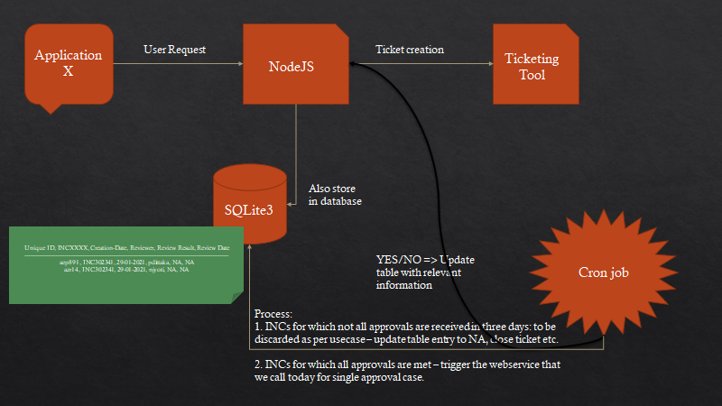

# nodejs-sqlite
A module to interact with sqlite from nodejs backend

# Database set up
We would be creating a table with the below schema and add some content so that we can work with our NodeJs code.

## Creation of the schema

`CREATE TABLE reviews ( id INTEGER PRIMARY KEY AUTOINCREMENT, ticket TEXT, review_requested_on TEXT, reviewer_id TEXT, review_result TEXT DEFAULT 'open', reviewed_on TEXT DEFAULT 'NA' );`

## Inserting sample data into the schema
Note that we do not supply any of these fields - 'id', 'review_result' or 'reviewed_on' fields.

`INSERT INTO reviews( ticket, review_requested_on, reviewer_id ) values ( 'INC00001', '29-Jan-2021', 'pdittaka' );`
`INSERT INTO reviews( ticket, review_requested_on, reviewer_id ) values ( 'INC01002', '1-Feb-2021', 'gdheeraj' );`
`INSERT INTO reviews( ticket, review_requested_on, reviewer_id ) values ( 'INC12002', '2-Feb-2021', 'vMarco' );`

## Retrieving data from the database

`SELECT * from reviews;`

1|INC00001|29-Jan-2021|pdittaka|open|NA
2|INC01002|1-Feb-2021|gdheeraj|open|NA
3|INC01036|2-Feb-2021|vmarco|open|NA

# Next up - NodeJs code to insert content to the table, update it. Finally, the cron job.

# NodeJS Code Overview
cls

update reviews set review_result = 'Approved', reviewed_on = '05-02-2021' where ticket ='INC13409' and reviewer_id = 'rvalden';
